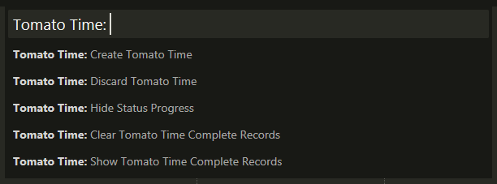
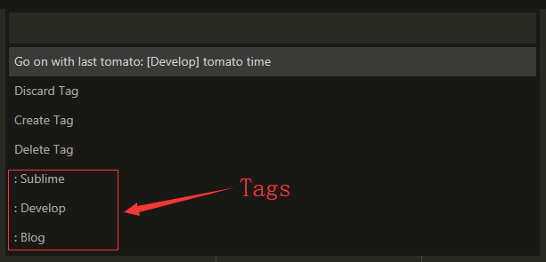
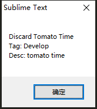
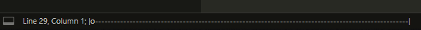
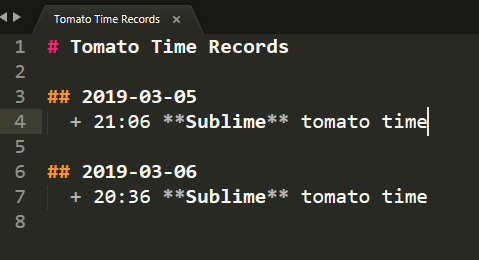

# Tomato Time  
> a sublime plugin to use tomato time  

[![GitHub version][version-image]][version-link]
[![MIT License][MIT-image]](./LICENCE)
[![Sublime Text][sublime-image]](sublime-link)

## Installation  

- Package Control  
Search `Tomato Time` via `Package Control: Install Package`  

- Git  
git clone this repository to `sublime/packages/path`  

- Zip  
download zip and unzip to `sublime/packages/path`  

## Key Bindings  

The package comes with some pre-defined keyboard shortcuts. You can always configure your own shortcuts via `Preferences` &rarr; `Package Settings` &rarr; `Tomato Time` &rarr; `Key Bindings`.  

|     Command     |  Linux & Windows & macOS |
| --------------- | ------------------------ |
|   Tomato Time   |   `Ctrl` + `Alt` + `T`   |

## How to use  

  
> Open the sublime command panel (`ctrl+alt+t`), and create a new tomato time(`Create Tomato Time`).
> In the tomato time, you can discard it(`Discard Tomato Time`) and show/hide progress in status bar(`Show Status Progress`/`Hide Status Progress`).
> When it's over, the record will be saved locally, you can show or clear it(`Show Tomato Time Complete Records`/`Clear Tomato Time Complete Records`).

**`Tomato Time: Create Tomato Time`**  
  
> When you create a tomato time, you can add a tag and description.  
> Tag can be create and delete.  
> The description will automatically record the last one.  

**`Tomato Time: Discard Tomato Time`**  

  

**`Tomato Time: Show Status Progress`**  

  

**`Tomato Time: Show Tomato Time Complete Records`**  

  

[MIT-image]: http://img.shields.io/badge/license-MIT-blue.svg?style=flat
[version-image]: https://badge.fury.io/gh/floydagithub%2Ftomato_time.svg
[version-link]: https://badge.fury.io/gh/floydagithub%2Ftomato_time
[sublime-image]: https://img.shields.io/badge/Sublime%20Text-3-orange.svg
[sublime-link]: https://www.sublimetext.com/3
